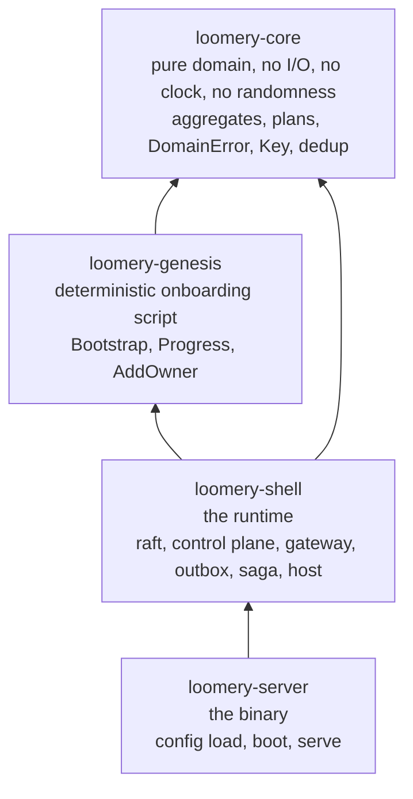
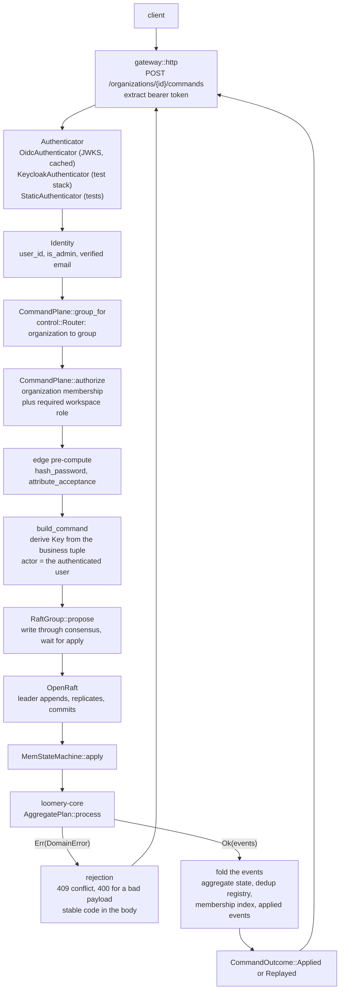
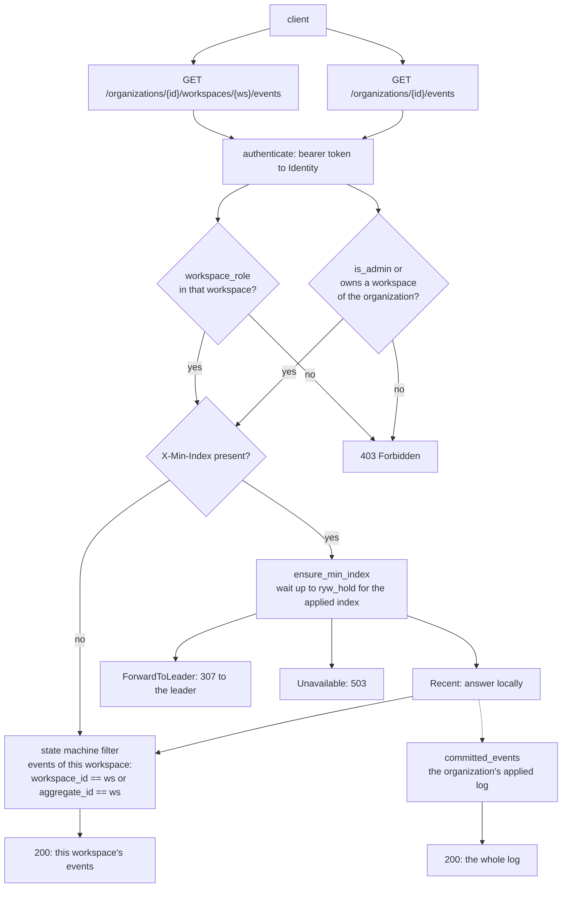
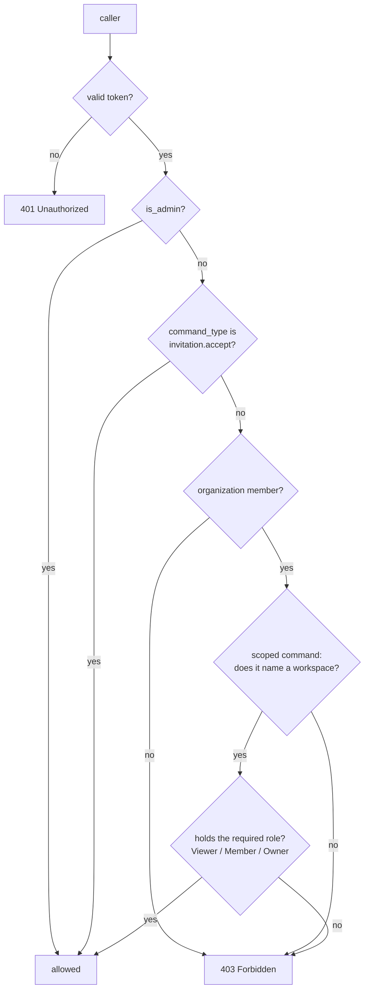
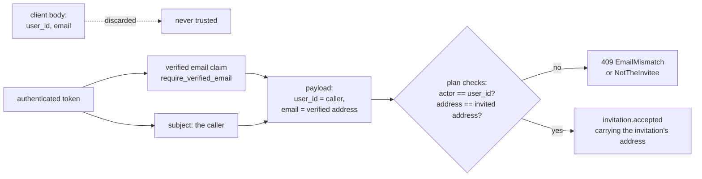
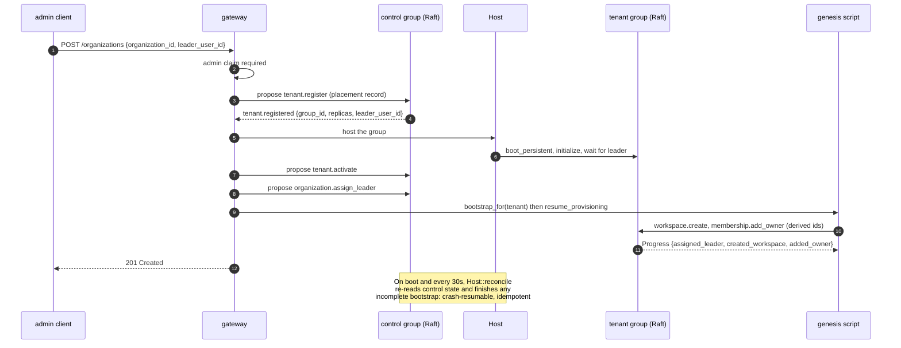
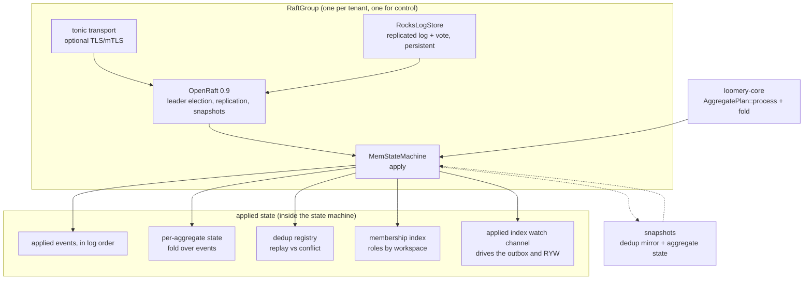
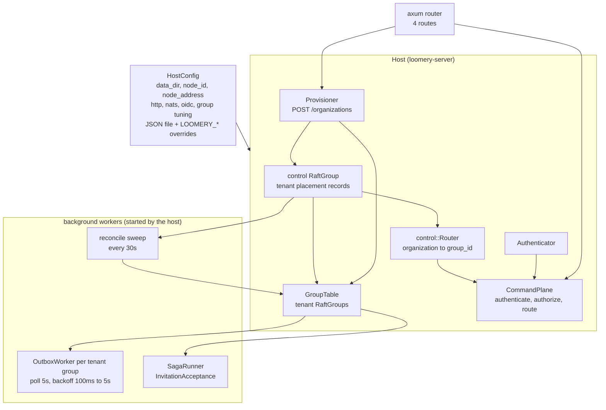
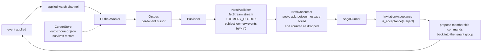
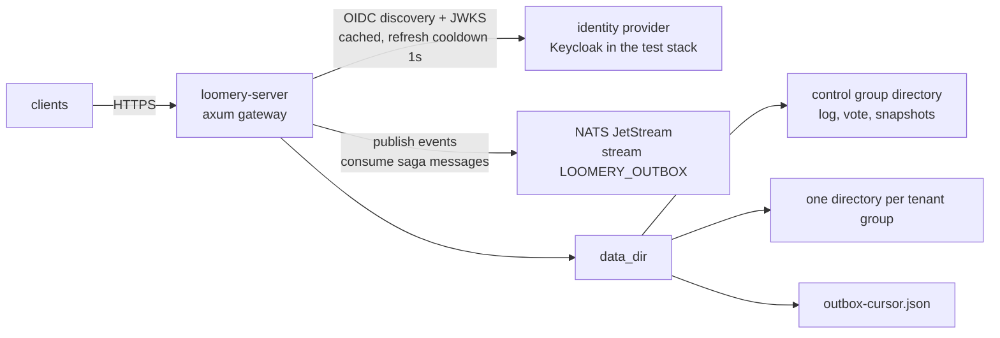

# Architecture at a glance

How the pieces built so far fit together, in diagrams. Everything here is
implemented and covered by the gates; the [design tracker](design.md) says what is
planned, and [host.md](host.md) documents the runtime gaps that remain.

Every diagram here is parsed by `mise run docs-mermaid` (the same parser a
renderer uses), so a broken one fails CI instead of a reader. To look at them,
`mise run docs-mermaid-render` writes SVGs to `tools/mermaid-check/out/`.

- [Crates and dependencies](#crates-and-dependencies)
- [The write path](#the-write-path)
- [The read path](#the-read-path)
- [Authorization](#authorization)
- [Onboarding and provisioning](#onboarding-and-provisioning)
- [Inside a group](#inside-a-group)
- [The runtime host](#the-runtime-host)
- [Outbox and sagas](#outbox-and-sagas)
- [Deployment](#deployment)
- [What is not built yet](#what-is-not-built-yet)

## Crates and dependencies

Four crates, each with one job. Dependencies point *downward* only: the domain
never learns about Raft, HTTP or NATS.

| Crate | Owns |
|---|---|
| `loomery-core` | Command/event vocabulary and the `AggregatePlan` that decides what a command means. Injected timestamps and ids (D5/D10/D12): same input, same output, no ambient state. |
| `loomery-genesis` | The onboarding script (`AssignLeader`, `CreateWorkspace`, `AddOwner`) as a resumable `Progress` state machine, and the derived ids that make it replayable. |
| `loomery-shell` | Everything that touches the outside world: the Raft group and its storage/transport, the control plane, the gateway, the outbox, the saga runner, and the `Host` that wires them. |
| `loomery-server` | A thin binary: read configuration, install the TLS provider, build the authenticator, boot the host, serve until a signal. |

## The write path

One route, one sequence of gates. Nothing untrusted reaches consensus, and
nothing *pure* runs after it.

Two properties are worth naming, because they are what makes retries safe:

- **Idempotence is derived, not negotiated.** The command's `Key` is a UUIDv5 of
  the business tuple, so re-submitting an identical command is a replay, and the
  dedup registry — *applied* state, not the log tail — answers
  `Applied::Replayed`. A replay whose fingerprint differs is a conflict (D12).
- **Unknown is not failure.** A consensus error means the outcome is *unknown*;
  the caller re-reads rather than assuming nothing happened.

## The read path

Reads are scoped, and a read may be answered by the leader's own state or
forwarded — the `X-Min-Index` gate is what makes read-your-writes hold.

## Authorization

Every write is checked against the role it needs; reads are checked against a
role in the workspace they name. `is_admin` bypasses all of it, and exactly one
command is exempt.

Roles are ordered by authority (`Viewer < Member < Owner`), and "organization
administrator" means *owns at least one workspace of the organization*. The
membership index that answers these questions is folded from applied events, so
it cannot disagree with the log.

The acceptance is exempt because the invitee is a stranger until it lands — which
is exactly why the gateway, not the client, supplies its attribution:

## Onboarding and provisioning

Provisioning is the control plane's job; the genesis script is the tenant's. A
crash between them is recovered from state alone.

## Inside a group

One `RaftGroup` per tenant, plus one for the control plane. The state machine is
where the pure core runs, and everything a read needs is applied state.

## The runtime host

`Host` is the wiring: two kinds of group, one projected router, one command plane,
and the background tasks that keep the log moving outward.

## Outbox and sagas

The log is the source of truth; everything else is derived from it. Publishing is
at-least-once with a persisted cursor, and the saga is the consumer that closes
the onboarding loop.

Delivery is **at-least-once**: the cursor advances only after a publish is
acknowledged, so a crash re-publishes rather than losing an event. The saga is
therefore idempotent by the same derived-key rule as everything else.

## Deployment

What `loomery-server` talks to, and what is on disk.

The default test suite needs none of this: it runs against the trait boundaries
with in-process fakes. Keycloak and NATS are exercised by `mise run
test-services` (see [testing-services.md](testing-services.md)).

## What is not built yet

The diagrams above are the current system, not the target one. Not drawn, because
not implemented:

| Gap | What it means today |
|---|---|
| Multi-node groups and placements | Every group is single-node (`initialize` with one voter); the placement record has a `replicas` list, but nothing joins it. |
| Read models | Reads filter the applied log — `O(history)` per read, and a workspace's own events are matched by aggregate id. |
| Tracing | No OpenTelemetry; the host reports through `eprintln!`. |
| Snapshot-recovery hardening | The heavy restart paths are covered by tests, but interrupted snapshot build/purge injection is not. |
| Phases 2–7 | Work core (projects, comments, dependencies, follow), read APIs with keyset pagination, search, notifications. See the [design tracker](design.md). |
