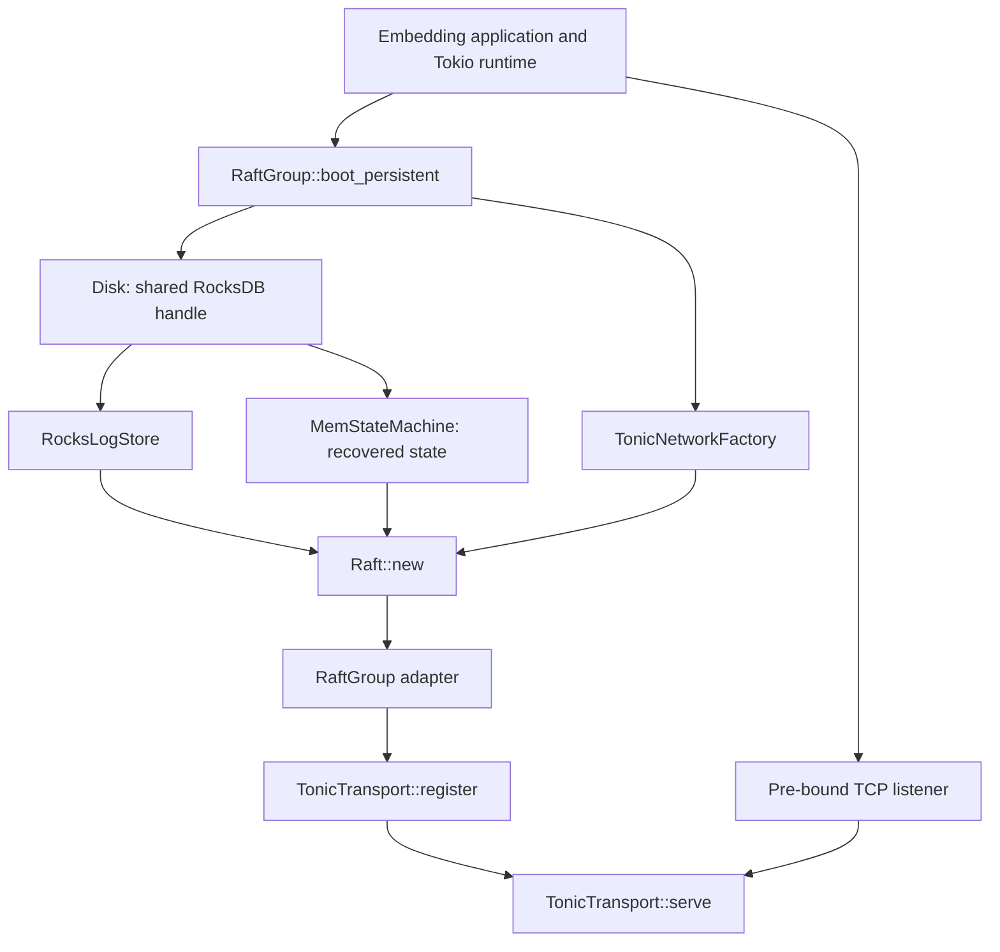
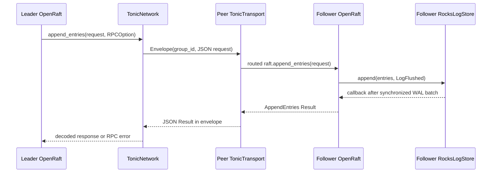

# Implementation guide: from crates to a running Raft group

This guide traces the current code: how the crates build, how a replica starts,
and how Raft calls the storage, network and domain layers. For option details,
use [raft-configuration.md](raft-configuration.md). For the wider architecture
and planned components, use [design.md](design.md).

## 1. What the crates build

| Crate | What it owns | Dependencies within the workspace |
|---|---|---|
| `loomery-core` | Commands/events, aggregate plans, deterministic state transitions, identity and dedup | None |
| `loomery-genesis` | The deterministic three-step tenant bootstrap script | Core |
| `loomery-shell` | Worker, Raft adapter, storage, networking and configuration | Core and genesis |

The [workspace manifest](../Cargo.toml) discovers `crates/*`, shares package
settings and enforces lints. The shell is a library, not a complete application
server. The embedding application owns its Tokio runtime, listeners, group
lifecycle and shutdown. The gateway, control-plane router, outbox and sagas are
implemented in the shell library ([`gateway.md`](gateway.md),
[`control-plane.md`](control-plane.md), [`outbox-and-sagas.md`](outbox-and-sagas.md));
the host still owns the HTTP server, the broker connection and its group
registry.

```sh
mise install
mise exec -- cargo build --workspace
mise exec -- cargo test --workspace --all-targets
```

The shell has two build-time steps beyond ordinary Rust compilation:

- [build.rs](../crates/shell/build.rs) uses `tonic_prost_build` to compile
  [raft.proto](../crates/shell/proto/raft.proto). `tonic::include_proto!` in the
  transport module includes the generated client/server types from Cargo's
  build output; generated code is not checked into the source tree. The schema
  exposes `AppendEntries`, `Vote` and `InstallSnapshot` RPCs in
  `loomery.raft.v1`.
- The `rocksdb` dependency builds its native backend with LZ4 and runtime
  bindgen. The build therefore needs native C/C++ tooling and libclang;
  protobuf generation needs `protoc`. Mise pins the Rust/developer tools in
  [mise.toml](../mise.toml), not all platform-native build dependencies.

For an executable example that starts actual replicas, inspect
[consensus_bench.rs](../crates/shell/examples/consensus_bench.rs) and
[node.rs](../crates/shell/examples/consensus_bench/node.rs).

## 2. The types joining the layers

[raft/mod.rs](../crates/shell/src/raft/mod.rs) declares `TypeConfig`, which tells
OpenRaft what Loomery's requests, responses and node metadata look like:

| Associated type | Loomery type | Purpose |
|---|---|---|
| `D` | `AppData::Command(Command)` | Replicated application input |
| `R` | `Applied` | Application result: appended, replayed or rejected |
| `NodeId` | `u64` | Replica identity within the group |
| `Node` | `openraft::BasicNode` | Peer URI stored in membership |
| `Entry` | `openraft::Entry<TypeConfig>` | Log ID plus blank, membership or application payload |
| `SnapshotData` | `Cursor<Vec<u8>>` | Serialized snapshot transfer/storage buffer |
| `AsyncRuntime` | `openraft::TokioRuntime` | Runtime implementation used by Raft |

A group ID selects the tenant Raft instance in the transport registry. A node
ID selects a replica in that group's membership. Use the same group ID on all
replicas, stable node IDs on restart, and a separate database path for each
`(group_id, node_id)` pair. The application is responsible for assigning paths
and routing commands to the correct group; the database does not enforce tenant
identity from the supplied path.

## 3. Configuration before startup

[config.rs](../crates/shell/src/config.rs) separates four concerns:

| `GroupConfig` field | Configures | Used by |
|---|---|---|
| `raft` | Heartbeats, elections, replication batching, snapshot scheduling and log retention | OpenRaft |
| `transport` | RPC/connect deadlines, message sizes, HTTP/2 windows, TCP keepalive and optional TLS | Network factory and tonic listener |
| `storage` | RocksDB memory/jobs/files and applied-state persistence mode | Disk and state machine |
| `proposals` | Opt-in command batching, byte/count bounds, collection delay and queue capacity | Shared proposal writer |

Start from `GroupConfig::default()`, set fields in Rust, or deserialize the shell
configuration using serde. The shell structs default omitted fields and reject
unknown fields. A supplied `raft` object follows OpenRaft's own serde behavior;
use a complete serialized OpenRaft configuration or set its fields in Rust. The
benchmark parser separately merges partial configuration onto defaults.

`boot_persistent` validates configuration, preflights outbound TLS material and
rejects an empty group ID before opening the database. It then checks the durable
persistence-mode marker before recovering state or starting Raft. Checkpoint is
the default; selecting snapshot recovery is an explicit experimental option.
Changing an existing database's mode fails startup.

Listener settings belong to the shared server, while outbound settings belong
to each group's network factory. Calling `boot_persistent` does not start a
listener or apply that group's server TLS settings to an existing listener.

## 4. How `boot_persistent` connects Raft to its dependencies

The implementation is in [raft/port.rs](../crates/shell/src/raft/port.rs).
Conceptually it performs this sequence:

```rust,ignore
let disk = Disk::open(path, &config.storage).await?;
let log = RocksLogStore::open(disk.clone());
let machine = MemStateMachine::open(disk, config.storage.state_persistence).await?;
let network = TonicNetworkFactory { group_id, config: config.transport };
let raft = Raft::new(
    node_id,
    Arc::new(config.raft.validate()?),
    network,
    log,
    machine.clone(),
).await?;
```

`Disk` and the persistent state-machine constructor are internal; public callers
use `RaftGroup::boot_persistent`. The returned adapter retains the Raft handle
and another `Arc` to the state machine for local reads.



OpenRaft invokes the supplied storage and network traits. The stores do not run
an independent replication loop, and the network service does not create Raft
groups when requests arrive.

## 5. Start the listener and initialize a new group

This complete function demonstrates a single persistent voter with plaintext
loopback networking. A real application keeps the listener running while serving
its workload. The one-second wait below only gives this demonstration a finite
lifetime; it is not a readiness or shutdown policy.

```rust
use anyhow::Result;
use loomery_shell::{
    config::GroupConfig,
    raft::{RaftGroup, transport::TonicTransport},
};
use openraft::BasicNode;
use std::{collections::BTreeMap, path::Path, time::Duration};
use tokio::{net::TcpListener, sync::oneshot};

pub async fn start_example() -> Result<()> {
    let mut config = GroupConfig::default();
    config.raft.heartbeat_interval = 100;
    config.raft.election_timeout_min = 250;
    config.raft.election_timeout_max = 500;

    let listener = TcpListener::bind("127.0.0.1:7001").await?;
    let address = format!("http://{}", listener.local_addr()?);
    let group_id = "tenant-example".to_owned();
    let group = RaftGroup::boot_persistent(
        1, group_id.clone(), Path::new("data/tenant-example/1"), config.clone(),
    ).await?;
    let transport = TonicTransport::default();
    transport.register(group_id.clone(), group.raft()).await?;

    let server_transport = transport.clone();
    let (stop, stopped) = oneshot::channel::<()>();
    let server = tokio::spawn(async move {
        server_transport.serve(listener, config.transport, async move {
            let _ = stopped.await;
        }).await
    });

    let raft = group.raft();
    // Only the designated bootstrap replica does this for a NEW group.
    if !raft.is_initialized().await? {
        raft.initialize(BTreeMap::from([(1, BasicNode::new(address))])).await?;
    }
    // On restart, the leader may differ. This waits for any elected leader.
    raft.wait(Some(Duration::from_secs(5)))
        .metrics(|m| m.current_leader.is_some(), "leader available")
        .await?;

    tokio::time::sleep(Duration::from_secs(1)).await;
    group.shutdown().await?;
    transport.unregister(&group_id).await;
    let _ = stop.send(());
    server.await??;
    Ok(())
}
```

The function is a wiring example: a production host must also supervise the
server task, clean up on startup errors and own its application shutdown signal.
Stopping Raft does not automatically stop the listener. After shutting down,
release every group/Raft/store handle before reopening its database path.

For three voters, first start and register all three local replica services,
using different paths and reachable peer URIs. On the designated bootstrap
replica, initialize the new group with that node as its first voter and wait for
leadership. On the leader, then:

```rust,ignore
raft.add_learner(2, BasicNode::new("http://node-2:7001"), true).await?;
raft.add_learner(3, BasicNode::new("http://node-3:7001"), true).await?;
raft.change_membership(std::collections::BTreeSet::from([1, 2, 3]), false).await?;
```

The `true` learner argument waits for catch-up. The membership change promotes
these replicas to voters through Raft. Do not independently initialize each
replica or reinitialize a recovered group. `boot_single_node` is a different
helper: it uses memory and a no-op network, and initializes its single voter.

### Add a group when a tenant is created

The APIs above can create and register groups at runtime. The tenant-creation
controller, placement records and router **are** implemented
([`shell::control`](../crates/shell/src/control), [`control-plane.md`](control-plane.md));
the host still owns replica booting, transport registration and the periodic
reconciliation sweep. The following is the host orchestration around them:

1. Record the tenant identity and intended replica placement in the control
   plane, with a provisioning status. Retain the same organization ID,
   bootstrap inputs, group ID and node IDs across retries.
2. On each selected host, call `boot_persistent(node_id, group_id, path, config)`
   and register the returned handle with that host's existing
   `TonicTransport`. Use a distinct database path for each replica. The shared
   listener can keep running; it reads the registry for each incoming RPC.
3. Initialize membership **once**, on the designated bootstrap replica of a
   new group. Add/catch up the other replicas as learners, then promote the
   intended voters using `change_membership`, as shown above.
4. On the elected leader, construct the deterministic
   [`Bootstrap`](../crates/genesis/src/script.rs) inputs and call
   [`bootstrap::run(&mut group, &bootstrap)`](../crates/shell/src/bootstrap.rs).
   This commits the leader assignment, default workspace and Owner membership.
   These are sequential Raft writes, not one atomic multi-command transaction;
   retries resume from applied events rather than restarting completed steps.
5. Once genesis completes, publish the tenant's active routing entry and allow
   its application traffic. Keep incomplete provisioning distinguishable from
   an active tenant so callers cannot observe a partially bootstrapped tenant.

The host must retain `RaftGroup` handles in its own registry, keyed by group ID,
for workers, reads and lifecycle management. `TonicTransport` retains cloned
Raft handles for peer RPCs; it is not that application registry or a placement
controller. `register` rejects an already registered ID. A reconciliation loop
should recognize an existing running group rather than booting another copy
against the same path.

After a crash, the controller should reconcile its placement/provisioning
records, reopen the same databases, preserve recovered membership and resume
missing genesis work. Do not blindly call `initialize` on every retry or let
all hosts initialize independently. This coordination remains future work.

### Remove a group when a tenant is deleted

There is currently **no tenant-deletion command, deletion controller or automatic
storage cleanup**. `shutdown` and `unregister` provide local lifecycle building
blocks. A durable deletion workflow must coordinate the control plane, all
replica hosts and integrations; deleting one local database does not delete the
tenant across the cluster.

The intended sequence is:

1. Commit a tenant deletion/tombstone record in the control plane and withdraw
   its active routing entry. Fence new tenant commands and pause its bootstrap,
   reconciliation and background producers. Restart reconciliation must honor
   the tombstone so retained databases cannot resurrect the tenant.
2. Resolve in-flight requests and any required committed outbox delivery or
   archival before stopping the group. The desired deletion/retention policy
   must define what happens to pending integration work; the outbox and saga
   runner exist ([`outbox-and-sagas.md`](outbox-and-sagas.md)) but the NATS
   binding is deployment wiring. Cross-group coordination uses that choreography
   model, not an atomic transaction spanning the control and tenant groups.
3. On **every replica host**, remove the group from the host's application
   registry, call `group.shutdown().await?`, unregister its peer-RPC route and
   release every clone of its group/writer/Raft/storage handles. Hosts report completion
   to the deletion controller so unavailable hosts can finish after reconnecting.
4. After local handles and in-flight tasks are released, retain/archive or
   physically remove that replica's database directory according to the selected
   policy. Record progress so partial cleanup can be retried. Removing live
   RocksDB files while handles remain open is not a group shutdown operation.
5. Complete deletion only when the required hosts and external-data cleanup
   have acknowledged it. Keep the tombstone/retired identity so delayed workers
   or messages cannot recreate the group. Backups and integration-owned data
   need their own cleanup policy; unregistering a listener route does not erase
   them.

The implemented **local stop** portion is:

```rust,ignore
// The host has already fenced tenant traffic and removed its owned registry entry.
group.shutdown().await?;
transport.unregister(&group_id).await;
drop(group);
// Also release independently retained Raft/store handles and in-flight tasks.
// The deletion controller can now apply its local retention/cleanup policy.
```

Keep the shared tonic listener running for other tenants. `unregister` removes
only this route; subsequent RPCs for the removed group receive `NotFound`. It
neither stops Raft nor deletes its database, and already-routed requests may
hold their own handle clones. `shutdown` stops local Raft, but does not issue a
cluster-wide tenant deletion.

Removing one **replica** from an otherwise active group is a different operation:
commit a membership change retaining a valid voter set, then retire the removed
replica locally. Do not try to delete an entire tenant by changing its membership
to an empty voter set.

## 6. How outbound and inbound networking meet

[transport.rs](../crates/shell/src/raft/transport.rs) implements both sides:

1. OpenRaft calls `TonicNetworkFactory::new_client(target, node)` with membership
   metadata. This creates a peer object without connecting immediately.
2. On the first RPC, `TonicNetwork::client` builds a tonic endpoint from
   `BasicNode.addr`, validates its HTTP/HTTPS scheme, loads configured TLS,
   creates a lazy channel and caches the client. Tonic reconnects the channel.
3. `request` serializes the pinned OpenRaft request into the envelope's `json`
   bytes and attaches the factory's `group_id`. Each request gets the lesser of
   OpenRaft's hard TTL and the configured request timeout; a Tokio timeout also
   bounds the RPC await.
4. The remote tonic service looks up the registered group, deserializes the RPC
   and invokes that group's `raft.append_entries`, `raft.vote` or
   `raft.install_full_snapshot`. Unknown groups return gRPC `NotFound`.
5. The server serializes OpenRaft's `Result` into the reply. The client decodes
   either the response or a remote Raft error; connection/timeout/decode failures
   map into OpenRaft RPC errors.



This is OpenRaft 0.10 `RaftNetworkV2`. `full_snapshot` fragments the snapshot
itself and sends it as one **client-streamed** `InstallSnapshot` RPC: each
`SnapshotChunk` carries raw bytes, the first also carries the group id and the
JSON opening metadata, and the follower reassembles in the handler frame before
calling `install_full_snapshot`. A stream that ends without the final fragment is
aborted, never installed.

Replication uses openraft's **default sequential `stream_append`**: one
`AppendEntries` request on the envelope, one response back, per follower. A
bidirectional `StreamAppend` RPC was built on this branch, measured at level to a
few percent either way, and removed — the design record and the measurement are in
[the migration note](research/openraft-010-migration.md#pipelined-append-leg-5-built-measured-removed)
and [the benchmark](benchmarks/deployment-scale.md#the-win-is-the-migration-not-the-pipelining).

0.9 fragmented snapshots in the core and replicated one unary RPC at a time. The
`Envelope` RPCs still carry JSON request/Result types. The protobuf package is
versioned, but its JSON payload still couples peers to the pinned OpenRaft types.
Wire upgrades need compatibility review.

With TLS, use HTTPS membership URIs and configured peer CA/name verification.
Server TLS is loaded when `serve` starts; outbound material is checked at boot
and loaded when clients are created. A server client-CA bundle requires client
certificates for mTLS. The listener explicitly sets TCP_NODELAY and keepalive
on accepted sockets. See [TLS configuration](raft-configuration.md) for paths,
identities and rotation limits.

## 7. What a write does

The application or worker uses [GroupOps](../crates/shell/src/group.rs), or clones
`group.writer()` for concurrent producers. The
[shared proposal writer](../crates/shell/src/raft/proposal.rs) calls
`raft.client_write(AppData::Command(command))` by default. With opt-in batching,
it collects queued commands into `AppData::Batch` with bounded count, bytes and
collection time. All producers of that group share one queue.

OpenRaft appends and replicates the entry, commits it after the required voter
quorum, and passes committed entries to the state machine. Each replica applies
the commands in order through the pure core. The writer splits `Applied::Batch`
into individual responses after application, including checkpoint persistence
when configured. Commands share a Raft index but retain their own command/event
identities and dedup/rejection outcomes. A rejected command does not roll back
its siblings. Direct `raft().client_write` calls bypass the queue; sequential
bootstrap steps remain sequential.

See [batch configuration](raft-configuration.md#opt-in-command-batching) and
[measured gains](benchmarks/batching.md). Every replica must understand batch
entries before enabling the option; batching defaults to disabled.

[state_machine.rs](../crates/shell/src/raft/state_machine.rs) dispatches by
command type to organization, workspace or membership. Its application path:

1. Update the applied log ID; apply membership entries when present.
2. For a command, look up its aggregate state and check the dedup registry.
3. Run the aggregate's pure `prepare` through `process`.
4. Fold produced events into aggregate state and append them to applied events.
5. Record the causation key and intent fingerprint after successful application.
6. Complete the selected persistence work and return `Applied`.

Checkpoint mode awaits full-state persistence before returning. Snapshot mode
returns after in-memory application; recovery depends on the durable log and
snapshots. **Both acknowledge writes after quorum commit and application.**
Neither mode acknowledges local writes first and replicates them later.

The port maps `Applied` to appended/replayed success or domain rejection.
A replay returns the original intent's index; it is not another domain event.
Timeouts and leadership movement can leave an unknown outcome, so callers
re-read before retrying. The [genesis worker](tutorials/genesis-worker.md) follows
that rule to resume provisioning without duplicating completed steps.

`committed_events` reads the local state machine directly. It does not ask a
quorum and may lag on followers. The gateway applies the read-your-writes gate
around it (`gateway::ensure_min_index`, the `X-Min-Index` header): it waits for
the requested minimum applied index, or answers a leader hint / `503` rather
than stale data. The read method itself stays a local read.

## 8. How storage, snapshots and restart connect

[disk.rs](../crates/shell/src/raft/disk.rs) wraps an `Arc<rocksdb::DB>`.
Its cloned handles share one database per replica/group. Resource settings are
applied on open; operations run through `spawn_blocking`. Durable writes use
`WriteOptions::set_sync(true)` with WAL enabled.

| Database keys | Owner | Contents |
|---|---|---|
| `l` + big-endian log index | `RocksLogStore` | JSON-encoded Raft entries, ordered by index |
| `vote`, `committed` | `RocksLogStore` | Election vote and recoverable committed pointer |
| `purged` | `RocksLogStore` | Purge floor, atomically updated with covered-log deletion |
| `state_persistence` | State machine startup | Immutable recovery-mode choice |
| `state` | State machine | Full applied-state checkpoint |
| `snapshot` | State machine | Last durable Raft snapshot and its metadata |

[rocks_log_store.rs](../crates/shell/src/raft/rocks_log_store.rs) batches log
appends and invokes `LogFlushed::log_io_completed` only after the synchronized
write finishes. Truncation removes a conflicting suffix; purge removes a covered
prefix and atomically records its floor. OpenRaft decides when to invoke these.

On startup, `MemStateMachine::open` checks the mode marker, restores `state` in
checkpoint mode or `snapshot` in snapshot mode, rebuilds dedup and retains the
stored snapshot for serving peers. `Raft::new` then uses the supplied stores to
recover membership/log state and replay committed entries after the restored
applied index. A fresh snapshot-mode database with no snapshot recovers from
the committed log alone.

Snapshots serialize aggregate state, applied events, dedup, membership and the
applied log ID. OpenRaft schedules a builder according to `snapshot_policy`.
The builder copies a consistent state view, serializes on the blocking pool,
persists the snapshot and only then publishes it. Copying and serialization
currently hold a state read lock. Receiving a snapshot atomically persists both
state and snapshot records before replacing live state. OpenRaft's snapshot
coverage/retention rules govern subsequent log purge; an apply checkpoint is
not itself a published Raft snapshot.

See [checkpoint-policy.md](research/checkpoint-policy.md) for the recovery
contracts and [checkpoint-spike.md](benchmarks/checkpoint-spike.md) for measured
tradeoffs. Full-state checkpoint cost grows with history; snapshot-mode recovery
may replay a longer suffix. Mode protection is per database and is always on.

The [storage performance investigation](research/consensus-storage-performance.md)
traces OpenRaft 0.9.25's append callback wait (which the 0.10 migration removed —
see the note there), synchronized committed-pointer writes and actual
leader/follower batch sizes. It also tests why stopping Raft
does not close RocksDB while state-machine handles remain alive.

## 9. Where to inspect and verify this flow

- [persistent_tests.rs](../crates/shell/src/raft/persistent_tests.rs): real
  three-node bootstrap, replication, restart, snapshot transfer, OpenRaft storage
  suites and mode-switch protection.
- [tls_tests.rs](../crates/shell/src/raft/tls_tests.rs): trust, hostname and mTLS
  behavior using ephemeral test certificates.
- [Benchmark node](../crates/shell/examples/consensus_bench/node.rs): a concrete
  host that binds, boots, registers, initializes membership and shuts down.
- [Benchmark driver](../crates/shell/examples/consensus_bench/driver.rs): creates
  replica processes, applies load, kills leaders and verifies database recovery.

```sh
mise run verify
mise exec -- cargo test --workspace --all-targets
mise run bench-consensus
mise run bench-persistence -- --output benchmark-results/persistence-comparison
```

The library exposes the building blocks described here. Tenant placement,
startup reconciliation, gateway routing, RYW middleware and the outbox still
need host/control-plane orchestration.
