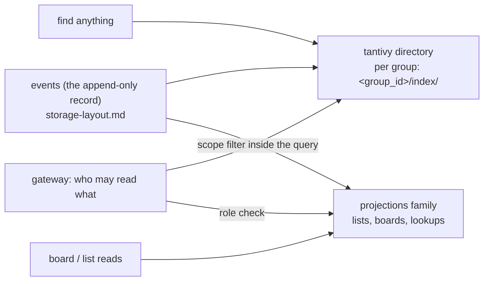

# Search — "find anything" within a tenant

**Status: shape decided ([D6](design.md#d6--fts-engine), [D9](design.md#d9--storage-of-cold-read-model-state)),
not implemented.** Search is [principle 11](design.md#1-what-loomery-is) of the
design: a first-class read path, not a report.

## The shape

- **One index per tenant**, beside that tenant's database. The tenant is the
  index, so cross-tenant results are not a filter away — they are unreachable.
- **The index is derived.** The record is `events`; an index is dropped and rebuilt
  from it whenever it is wrong, stale or has changed shape.
- **Scoping is part of the query.** The caller's readable workspaces (and their
  role in each) are a filter inside the search, never a post-filter over results:
  filtering afterwards breaks counts and pagination, and it is the leak class the
  read-scoping work already closed for the organization log.

## What is findable

| | v1 | Later |
|---|---|---|
| Entities: tasks, projects, comments, workspaces, documents | ✅ indexed as documents | — |
| The history that produced them | ❌ not indexed (reads answer it from `events`) | an event index is cheap to add, because the record is complete and ordered |
| Free text | ✅ title/summary/body fields, BM25-ranked | — |
| Fields | ✅ workspace, project, status, assignee, labels, dates | — |
| Vectors (semantic search) | ❌ ([D7](design.md#d7--vector-store-phase-4), Phase 4) | `sqlite-vec`, `hnswlib-rs` or PG — unchanged by this decision |

Whether "find anything" is meant to include history is **open**; the recommendation
is entities first, because the UI's questions ("what is there", "what do I owe") are
entity-shaped, and the record already answers "what happened" by scanning it.

## Schema (sketch)

| Field | Type | Notes |
|---|---|---|
| `entity_id` | text, indexed + stored | the aggregate id — the join key back to `state`/`projections` |
| `kind` | fast field | task, project, comment, workspace, document |
| `workspace_id` | fast field | the scope filter's leading term |
| `project_id`, `assignee`, `status` | fast fields | filters and facets |
| `title` | text (indexed, with positions) | heavy weight in ranking |
| `body` | text (indexed, with positions) | default weight |
| `labels` | text, facet | multi-valued |
| `created_at`, `updated_at` | fast u64 (nanoseconds) | sorting and range filters |

Fast fields are what make filter-and-rank one pass, which is exactly what
permission-scoped search needs: the scope filter is a fast-field term restriction
combined with the text query, so counts, facets and pagination are all computed
*within* what the caller may read.

## When the index is updated

Three options, and this is the one open decision in this document:

1. **In the apply path**, in the same batch as the state and events. Consistent
   with the record — a search never misses an event the caller can already read —
   but it puts the index on the durability path: an index write failure would have
   to fail the apply, which is a large cost for derived data.
2. **From the outbox**, asynchronously (the pattern the saga runner already uses).
   Cheap, keeps the apply path O(batch), and a failure is a retry rather than a
   failed write. Search then lags the record by a bounded interval, and the response
   must say so.
3. **Hybrid**: index from the outbox, and have the UI merge "recently changed"
   items from the record so a just-written task is never invisible.

**Recommendation: 2, with 3's disclosure.** Search responses carry the applied index
they were built from (`as_of`), so a client can tell staleness from silence, and the
read-your-writes guarantee stays where it is honest — on `events` reads, which the
`X-Min-Index` gate already covers. Option 1 is available later for entities that
must be searchable the instant they are written.

## Rebuild

A rebuild is a full replay of `events` into a fresh directory, in the background,
with a generation marker so a half-built index is never served:

1. build into `index.next/`,
2. mark it complete (a file with the record's applied index and a format version),
3. swap it in for `index/`, delete the old one.

Deterministic by construction (the same record and the same schema produce the same
index), which is also what makes the search tests meaningful. A rebuild is needed
after a schema change, a corruption, or a bug — and it is never a data-loss event.

## Tests this owes

- **Permission scoping**: a `Viewer` of one workspace searching the tenant never
  receives a hit from another (the search equivalent of the read-scoping test).
- **Tenant isolation**: a query against one group's index can never reach another
  group's documents.
- **Rebuild determinism**: rebuild twice from the same record → identical index;
  and the index's `as_of` equals the record's applied index when it is caught up.
- **Staleness bound**: after a write, the index reaches that write within the
  documented interval (measured, not asserted loosely).
- **Failure**: an index write failure does not fail an apply (option 2), and a
  failed rebuild leaves the previous index serving.

## Out of scope for v1

Cross-tenant search, platform-wide ANN (D7 says so explicitly), and external search
services: a Meilisearch or Typesense deployment per tenant is an operational
dependency this design does not need while the index can live beside the data.

## See also

- [storage-layout.md](storage-layout.md) — the database this index sits beside, and
  the `events` family it is built from
- [design.md](design.md) — principle 11,
  [D6](design.md#d6--fts-engine) (the engine),
  [D9](design.md#d9--storage-of-cold-read-model-state) (the projection store),
  [D7](design.md#d7--vector-store-phase-4) (vectors, Phase 4)
- [read-model-store-options.md](research/read-model-store-options.md) — why tantivy
  and not FTS5, and why the store is a column family
